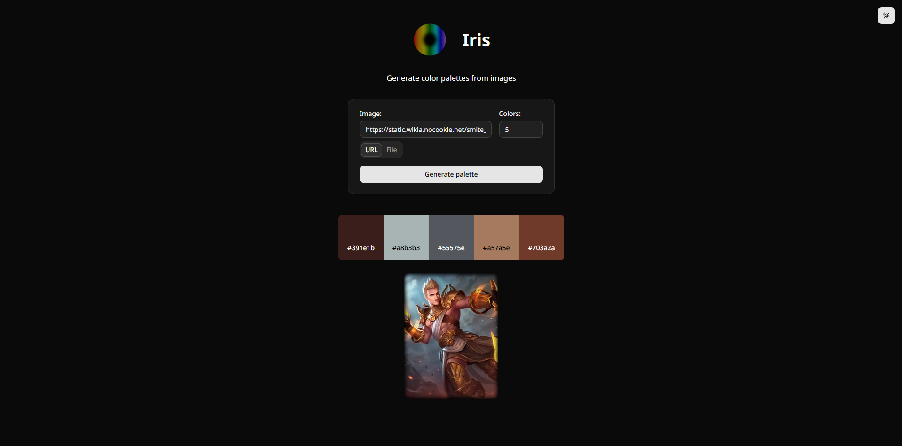

# Iris
Generate color palettes from images

## Palette Generator



Select an image from a URL or from a file, and the palette generator will pick out some colors.

## Usage

### Docker

#### Prerequisites

- [Docker](https://www.docker.com/)

#### Running

You can use the `compose.yml` file to run the application.

### Without Docker (Manual)

#### Prerequisites

- [.NET Runtime 8.0](https://dotnet.microsoft.com/en-us/download/dotnet/8.0) (CLI version)
- [ASP.NET Core Runtime 8.0](https://dotnet.microsoft.com/en-us/download/dotnet/8.0) (Web version)
- [Node.js v20+](https://nodejs.org/en) (Web version)

#### Installation

Download the latest version from the [Releases](https://github.com/ShadowXPA/Iris/releases) page.

#### Build (Alternative)

Clone the repository.  
Use `dotnet publish` to build the `Iris.Cli` and/or `Iris.WebApi`.  
For example:
```
dotnet publish src/Iris.Cli -c Release -r win-x64 --self-contained true -p:PublishSingleFile=true -p:DebugType=None -o publish/Iris.Cli-win-x64
```
For `iris.web` run the following commands:

1. Make sure you are in the `iris.web` folder:
```
cd src/iris.web
```

2. Install dependencies
```
npm ci
```

3. Build
```
npm run build
```

4. Copy the files to a fresh location
```
cp -r src/iris.web/.next/standalone/. [DESTINATION]
cp -r src/iris.web/.next/static [DESTINATION]/.next
cp -r src/iris.web/public [DESTINATION]
```

#### Running

#### CLI version

Simply run the executable in the console with the right arguments. Use `--help` for a list of arguments.

#### Web version

Run the `Iris.WebApi` executable.  
Set the `BASE_API_URL=http://[Iris.WebApi]` and `PALETTE_API_URL=/api/palette` environment variables, or create a `.env` file with those variables next to the `server.js` file, then run the `iris.web` with `node server.js`.
